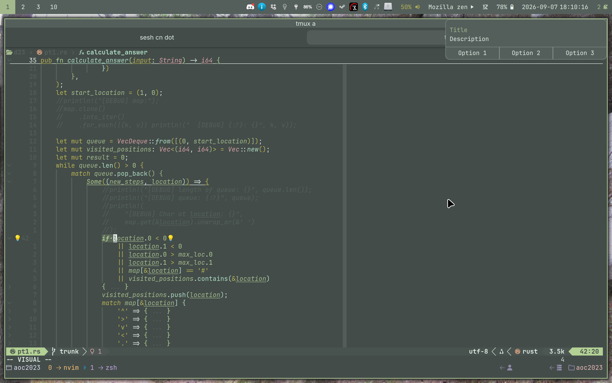

# MineItRiGrEight's dotfiles

Color scheme: [Rosé Pine](https://rosepinetheme.com/)

## Installation

### Prerequisites

* GNU Stow

### Install

Run `setup.sh`

### Uninstall

Run `unsetup.sh`

## Screenshots

### Hyprland + Quickshell + Ghostty + tmux + Neovim

